# ⚡ NeuralFlow V5
### Autonomous AI Infrastructure Resilience & Risk Orchestration Platform

[](https://github.com/aditya-upmanyu/Neural_Flow)
[](https://github.com/aditya-upmanyu/Neural_Flow)
[-7c5cfc?style=flat-square)](https://github.com/aditya-upmanyu/Neural_Flow)
[](https://nodejs.org)
[](LICENSE)

---

## 🌐 Live System & Quick Access

- 🖥️ **Live Web Dashboard:** [http://localhost:5173](http://localhost:5173)
- 🔌 **Backend Control Plane API:** [http://localhost:3001](http://localhost:3001)
- 🛒 **Integrated BharatBazaar Gateway:** [http://localhost:5001](http://localhost:5001)
- 🐙 **Official GitHub Repository:** [https://github.com/aditya-upmanyu/Neural_Flow](https://github.com/aditya-upmanyu/Neural_Flow)

---

## 📌 Executive Summary

Modern cloud infrastructure fails not because engineers lack alerts, but because **human Mean Time to Respond (MTTR) is measured in minutes while distributed cascading failures happen in milliseconds**.

**NeuralFlow V5** is a self-healing autonomous infrastructure resilience platform. It combines **predictive machine learning**, **deterministic safety guardrails**, and **sub-second traffic weight orchestration** to anticipate SLA violations, autonomously divert compromised traffic, verify real recovery, and maintain zero downtime across distributed microservices.

---

## 🏆 Key USPs & Architectural Differentiators

### 1. 🔮 Predictive Breach Detection (Not Reactive)
Traditional monitoring alerts you *after* a service has already crashed. NeuralFlow's neural network model analyzes multi-metric slopes (latency gradient, requests per second, error trajectory) to forecast an SLA violation **8 to 25 seconds before the breach actually occurs**.

### 2. 🛡️ 8 Deterministic Safety Gates (Zero Hallucinations)
AI autonomy without strict policy guardrails is dangerous. NeuralFlow enforces **8 deterministic safety gates** before any routing action can execute:
- `AI_CONFIDENCE`: Must exceed autonomous policy threshold.
- `SOURCE_DEGRADED`: Verified degradation on the source node.
- `TARGET_HEALTHY`: Target candidate health $\ge 70\%$.
- `TARGET_CAPACITY`: Target CPU utilization $< 80\%$.
- `FRESH_TELEMETRY`: Telemetry age $< 5,000\text{ms}$.
- `COOLDOWN_CLEAR`: Enforces stabilization window between consecutive reroutes.
- `FALLBACK_EXISTS`: At least 1 healthy alternative node available to prevent single points of failure.
- `TARGET_NOT_OVERLOADED`: Circuit breaker preventing cascading failure overload.

### 3. 🔬 Action Execution $\neq$ Recovery Verification
Taking an action does not mean the system recovered. NeuralFlow treats autonomous intervention and recovery as separate lifecycle phases. The **Independent Verification Engine** polls the node 3 consecutive times over an observation window. Only when latency drops below 120ms and health returns to $\ge 70\%$ is the incident formally resolved.

### 4. 📜 Auditable Decision Receipts & Provenance
Every autonomous action generates an immutable **Decision Receipt** containing complete provenance:
- **T1:** Incident Detection Timestamp & Telemetry Snapshot.
- **T2:** Action Decision Timestamp, Target Candidate Scores, and Policy Checks.
- **T3:** Verification Timestamp, Post-Action Telemetry, and Recovery Confirmation.
- Exportable as **JSON** or **CSV** for enterprise audit compliance.

### 5. 🎨 Zero-Flicker 60 FPS Network Canvas
Engineered with a high-performance Canvas 2D engine featuring:
- Real-time rotating dashed orbit rings (1 RPM).
- Radar sweeps with distance fade and 120° phase-offset node pulsing.
- High-velocity particle packets mapped dynamically to active routing weights.
- 3-phase chromatic recovery animations (`Red` $\to$ `Amber` $\to$ `Teal/Cyan`).

### 6. ⚔️ Autonomous AI vs. Human MTTR Benchmark
Direct side-by-side operational comparison showing:
- **AI Mode:** Sub-second autonomous failover ($\sim 800\text{ms}$ MTTR) with 0 dropped transactions.
- **Manual Mode:** Human-in-the-loop incident timer tracking operator reaction time, calculated revenue loss, and packet drop impact.

### 7. ⏹️ Auto-Containment & Traffic Normalization
Prevents cascading failovers. As soon as recovery is verified, attack simulation load is automatically contained, attack flags are cleared, and traffic distribution weights are normalized back to baseline (`34% / 33% / 33%`).

---

## 🏗️ System Architecture

```
                               ┌────────────────────────────────────────┐
                               │       Frontend Command Center (Vite)    │
                               │  • Real-Time Canvas 2D Topology        │
                               │  • Telemetry Charts (Recharts)         │
                               │  • Decision Receipts & Audit Center    │
                               │  • AI vs. Human Benchmark Panel        │
                               └───────────────────▲────────────────────┘
                                                   │ WebSocket / REST (:3001)
                               ┌───────────────────┴────────────────────┐
                               │         Backend Resilience Plane        │
                               │                                        │
                               │  ┌──────────────────────────────────┐  │
                               │  │   Orchestrator & Incident FSM    │  │
                               │  └───────────────┬──────────────────┘  │
                               │                  │                     │
                               │   ┌──────────────┴──────────────┐      │
                               │   │                             │      │
                               │   ▼                             ▼      │
                               │ ┌───────────────┐      ┌────────────┐  │
                               │ │  Brain.js ML  │      │  8 Safety  │  │
                               │ │ Anomaly Model │      │   Gates    │  │
                               │ └───────┬───────┘      └─────┬──────┘  │
                               │         │                    │         │
                               │         ▼                    ▼         │
                               │ ┌──────────────────────────────────┐   │
                               │ │    Dynamic Router & Proxy        │   │
                               │ └────────────────┬─────────────────┘   │
                               │                  │                     │
                               │                  ▼                     │
                               │ ┌──────────────────────────────────┐   │
                               │ │   Independent Verifier (3x Poll) │   │
                               │ └────────────────┬─────────────────┘   │
                               │                  │                     │
                               │                  ▼                     │
                               │ ┌──────────────────────────────────┐   │
                               │ │  Immutable Decision Receipt Hub  │   │
                               │ └──────────────────────────────────┘   │
                               └───────────────────┬────────────────────┘
                                                   │
                        ┌──────────────────────────┴──────────────────────────┐
                        │                                                     │
         ┌──────────────▼──────────────┐                       ┌──────────────▼──────────────┐
         │     Internal Mock Cluster   │                       │   Live BharatBazaar Gateway │
         │  • Node 1 (Testfire Bank)   │                       │  • BB-NODE-1 (Mumbai: 5001) │
         │  • Node 2 (Zero Bank)       │                       │  • BB-NODE-2 (Delhi: 5002)  │
         │  • Node 3 (VulnWeb PHP)     │                       │  • BB-NODE-3 (Bangalore)    │
         └─────────────────────────────┘                       └─────────────────────────────┘
```

---

## 🧠 AI / ML Engine Specifications

NeuralFlow V5 uses an on-device Feedforward Artificial Neural Network (Brain.js) trained on startup with a deterministic held-out evaluation:

```javascript
Architecture:
  - Hidden Layers: [5, 5]
  - Activation Function: Sigmoid
  - Training Dataset: 500 generated production telemetry samples
  - Split: 70% Train (350) / 15% Validation (75) / 15% Held-Out Test (75)
  - Accuracy on Held-Out Test: 88% - 92%+
  - Precision: 100.00% | Brier Calibration Score: ~0.71 | ECE: ~12.4%
```

### Telemetry Feature Vector:
1. `latency`: Instantaneous round-trip response time (ms).
2. `errorRate`: Rolling percentage of non-200 responses.
3. `queueSize`: Active backpressure queue depth.
4. `cpuUsage`: Processor load percentage.
5. `memoryUsage`: RSS memory footprint.
6. `requestsPerSecond`: Throughput volume.
7. `latencyTrend`: Slope of latency trajectory over rolling 5-second window.

---

## 🔄 Autonomous Incident State Machine (FSM)

```mermaid
stateDiagram-v2
    [*] --> NORMAL
    NORMAL --> DETECTED: Latency slope > threshold OR Critical status
    DETECTED --> PREDICTED: ML breach countdown <= 25s
    PREDICTED --> REROUTING: AI Mode (Safety Gates Evaluated)
    PREDICTED --> ACTION_PENDING: Manual Mode (Human Required)
    ACTION_PENDING --> VERIFYING: Operator executes manual reroute
    REROUTING --> VERIFYING: Autonomous traffic weight shifted (+40%)
    VERIFYING --> RESOLVED: Telemetry verified healthy (3x consecutive polls)
    RESOLVED --> COOLDOWN: Attack contained & weights equalized (34/33/33)
    COOLDOWN --> NORMAL: Stabilization timer expired
```



---

## 🚀 Quick Start Guide

### Prerequisites
- [Node.js](https://nodejs.org) (v18.0.0 or higher)
- npm (v8.0.0 or higher)

### 1. Clone & Install
```bash
git clone https://github.com/aditya-upmanyu/Neural_Flow.git
cd Neural_Flow

# Install dependencies for both backend and frontend
npm run install-all
```

### 2. Start the Resilience Platform
```bash
# Terminal 1: Launch Backend Engine (:3001)
npm run start:backend

# Terminal 2: Launch Frontend Command Center (:5173)
npm run dev --prefix frontend
```

### 3. (Optional) Run BharatBazaar E-Commerce Cluster
```bash
# Starts MongoDB & 3 BharatBazaar regional nodes (5001, 5002, 5003)
npm run start:bharatbazaar
```

Open your browser at **[http://localhost:5173](http://localhost:5173)**.

---

## 🧪 Automated Test Suite

NeuralFlow V5 includes a comprehensive automated test suite verifying machine learning, safety gates, state machine transitions, and verification engine integrity:

```bash
npm test
```

### Verified Test Output:
```
🧪 Running NeuralFlow V5 Comprehensive System Tests...

📦 1. Machine Learning Anomaly Detection:
  ✓ should train a neural network and detect anomalous traffic patterns

📦 2. Deterministic Safety Gates:
  ✓ should ALLOW_AUTONOMOUS_ACTION when all 8 safety gates pass with healthy target
  ✓ should REJECT when target node health is below threshold

📦 3. Incident State Machine:
  ✓ should instantiate state machine and perform valid state transitions
  ✓ should block invalid transition from EXECUTING to IDLE directly

📦 4. Independent Verification Engine:
  ✓ should confirm recovery when post-action telemetry verifies SLA compliance

📦 5. Auditable Decision Receipts:
  ✓ should generate structured decision receipts with complete provenance

========================================
Test Results: 7 passed, 0 failed
========================================
✅ ALL CRITICAL SYSTEM & CONTROL PLANE TESTS PASSED!
```

---

## 📡 Core API Reference

| Endpoint | Method | Description |
|---|---|---|
| `/api/health` | `GET` | System health check, uptime, ML model status, and node count |
| `/api/state` | `GET` | Canonical snapshot of active nodes, incident FSM, and mode |
| `/api/nodes` | `GET` | Real-time status, latency, CPU, RPS, and health scores |
| `/api/attack/start` | `POST` | Injects controlled traffic spike on target node ID |
| `/api/attack/stop` | `POST` | Contains active traffic injection and normalizes weights |
| `/api/mode` | `POST` | Switches platform mode (`AI` or `MANUAL`) |
| `/api/environment` | `POST` | Switches environment (`INTERNAL` or `EXTERNAL`) |
| `/api/reroute/manual` | `POST` | Executes operator-driven traffic weight shift |
| `/api/receipts` | `GET` | Returns all auditable decision receipts |
| `/api/receipts/latest` | `GET` | Returns most recent incident decision receipt |
| `/api/reset` | `POST` | Resets all telemetry baselines and incident history |

---

## 👨‍💻 Maintainer

**Aditya Upmanyu**  
- GitHub: [@aditya-upmanyu](https://github.com/aditya-upmanyu)  
- Project Repository: [https://github.com/aditya-upmanyu/Neural_Flow](https://github.com/aditya-upmanyu/Neural_Flow)

---

## 📄 License

This project is licensed under the **MIT License** - see the [LICENSE](LICENSE) file for details.
